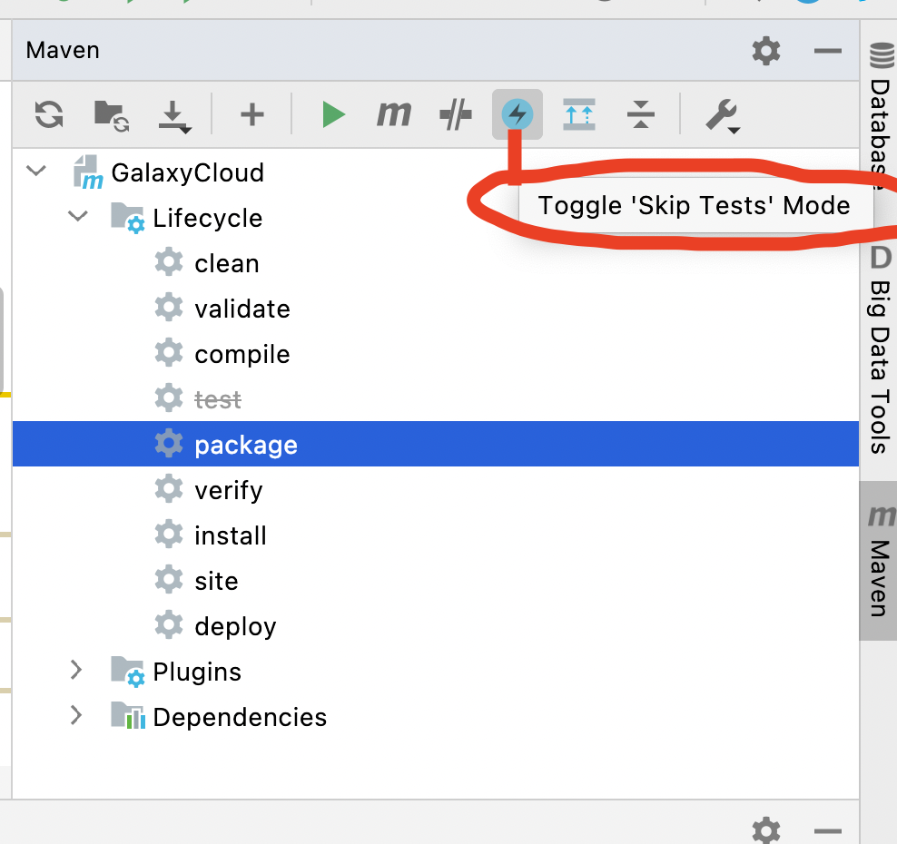
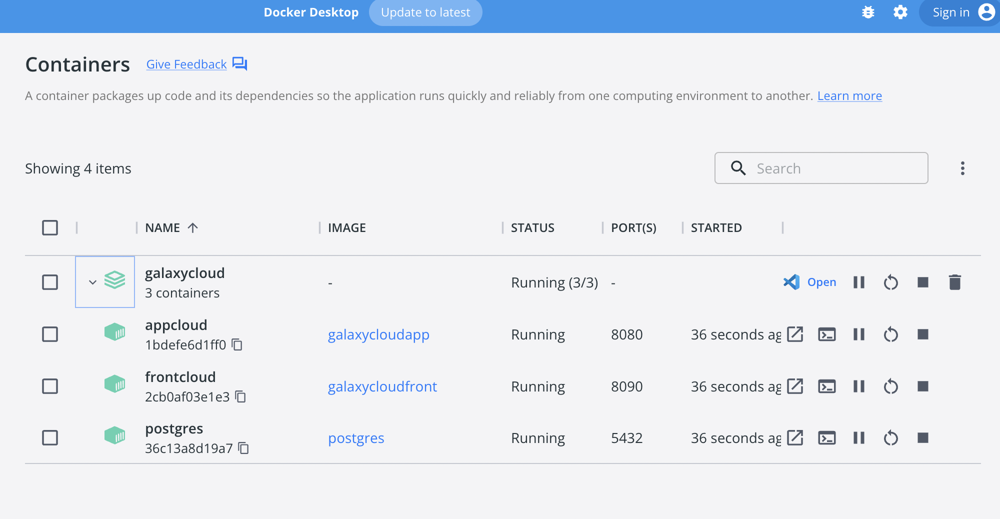
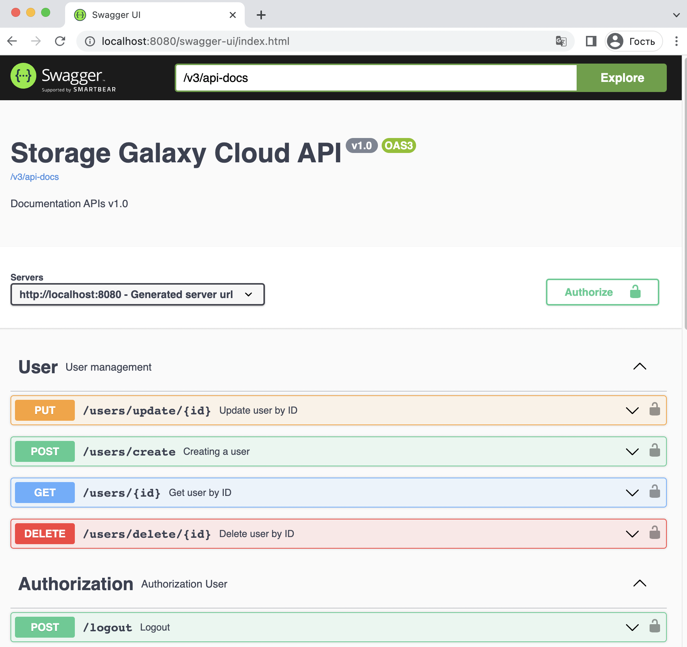
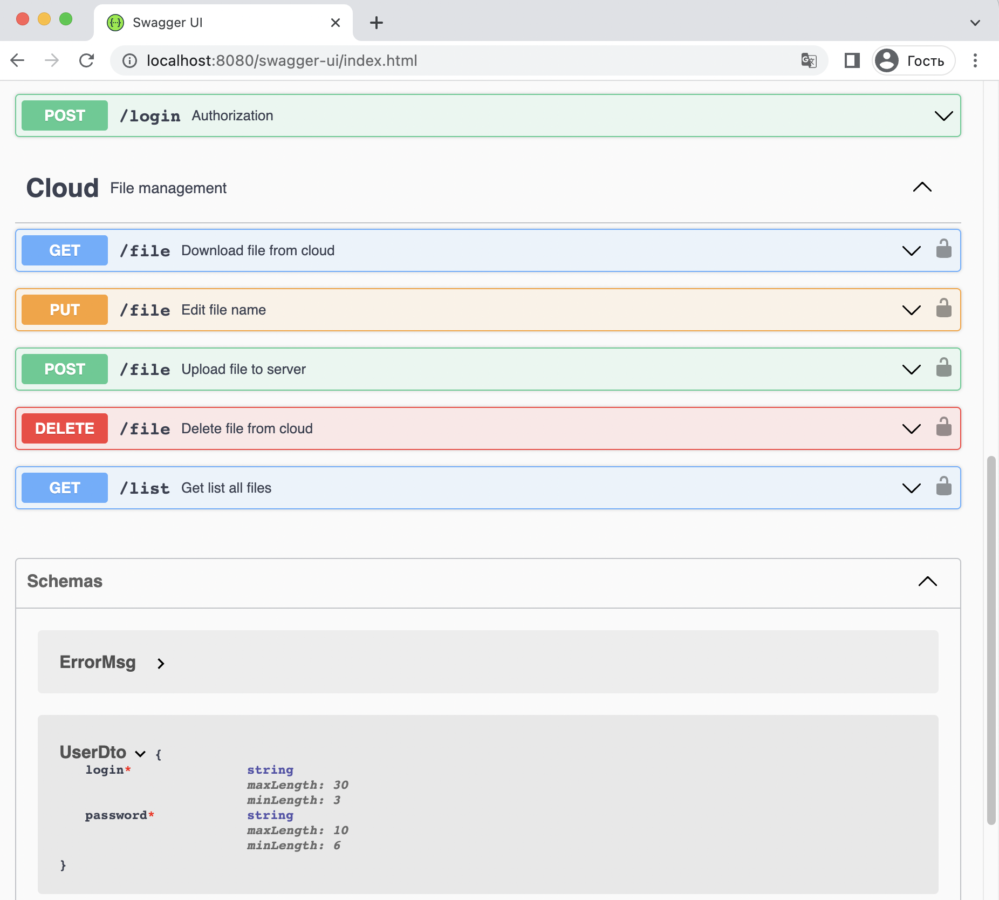
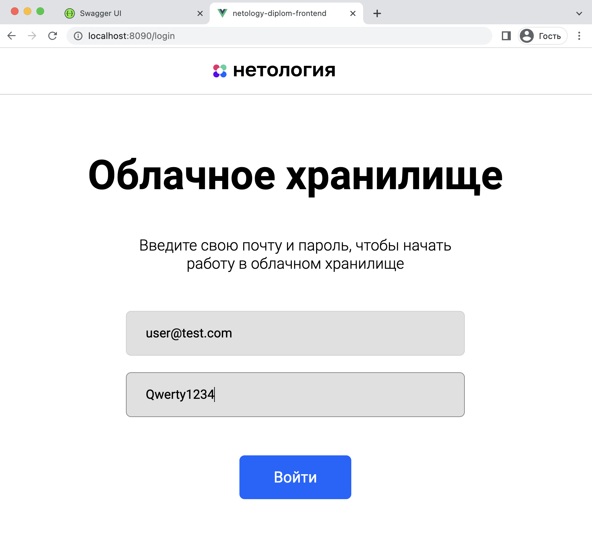
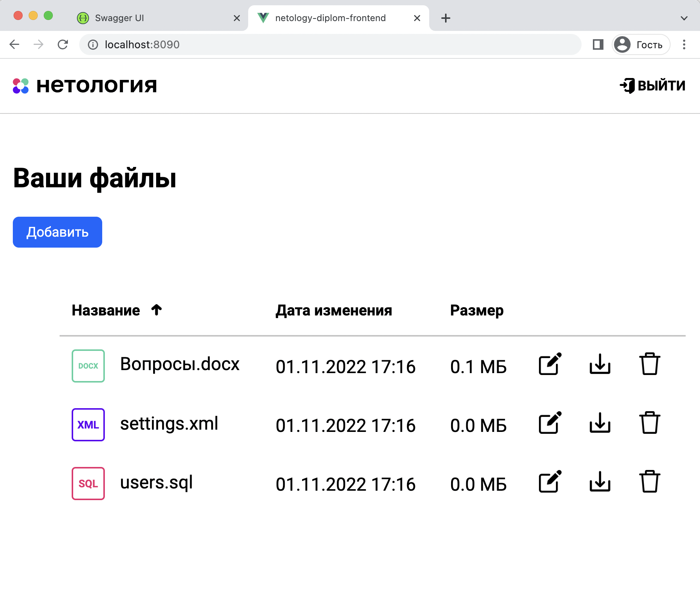
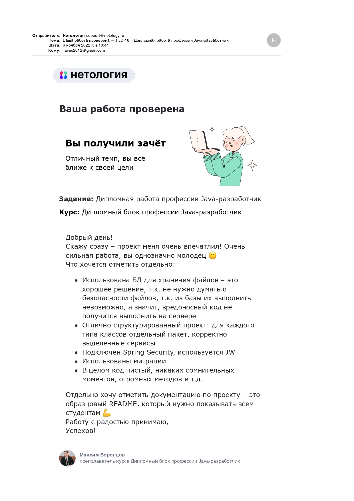

# “Облачное хранилище”

## Запуск приложения GalaxyCloud с помощью файла docker-compose.yml (Dockerfile) (frontendApp + backendApp + postgres)
- Клонируем проект на свой ПК [github.com/mySkillsKit/GalaxyCloud.git](https://github.com/mySkillsKit/GalaxyCloud.git)
- Запускаем приложение [Docker Desktop](https://www.docker.com/products/docker-desktop/);
- Запускаем терминал в папке `/GalaxyCloud` и собираем jar архив с нашим Spring REST приложением:
- ```mvn clean package -Dskiptests``` or ```mvn clean package -Dmaven.test.skip```
- Собирать jar файл также можно с помощью [IntelliJ IDEA](https://www.jetbrains.com/help/idea/work-with-tests-in-maven.html) 

- После успешной сборки в папке будет находиться jar файл:`/GalaxyCloud/target/GalaxyCloud-0.0.1-SNAPSHOT.jar`
- В терминале выполнить команду по сборке images и containers: 
- ```docker-compose up```
- В докере запустятся 3 приложения:
- Backend App Java 11 -> ```http://localhost:8080```
- Frontend App Node 15 -> ```http://localhost:8090```
- Database Postgres 14 -> ```http://localhost:5432```

- Запуск тестов: `mvn test` 

## Документация и проверить app Storage Galaxy Cloud API можно c помощью swagger:
### ```http://localhost:8080/swagger-ui/index.html```
### ```http://localhost:8080/v3/api-docs```

## Для тестирования backend + postgres нужно авторизовать пользователя:
 - Отправить POST запрос `http://localhost:8080/login`
 - JSON -> `{
"login": "user@test.com",
"password": "Qwerty1234"
}`
 - Полученный в ответ auth-token ввести в окно `Authorize` 

## Если в Базе Данных postgres нет этого пользователя, то нужно создать пользователя 
- Отправить POST запрос `http://localhost:8080/users/create`
- JSON -> `{
  "login": "user@test.com",
  "password": "Qwerty1234"
  }`



## Для тестирования frontend + backend + postgres нужно перейти по ссылке и ввести:
### `http://localhost:8090/login`
### логин `user@test.com` 
### пароль: `Qwerty1234`


- Выход из приложения: в терминале нажать "Ctrl+C"
- Удаление Docker контейнера: ```docker-compose down```


`http://localhost:8080/users/create`

`{
"login": "admin@test.com",
"password": "Qwerty1111"
}`

`{
"login": "admin@test.com",
"password": "$2a$12$pBqGg4hhFmlYJuRCNadI3ehWlX6EnLdpHgQRnkIinsh6rIPm6ZbyC"
}`
## Отзыв от Нетологии


## Описание проекта

Разработать приложение - REST-сервис. Сервис должен предоставить REST интерфейс для возможности загрузки файлов и вывода списка уже загруженных файлов пользователя.
Все запросы к сервису должны быть авторизованы. Заранее подготовленное веб-приложение (FRONT) должно подключаться к разработанному сервису без доработок,
а также использовать функционал FRONT для авторизации, загрузки и вывода списка файлов пользователя.

## Требования к приложению:

- Сервис должен предоставлять REST интерфейс для интеграции с FRONT
- Сервис должны реализовывать все методы описанные [yaml файле](./CloudServiceSpecification.yaml):
    1. Вывод списка файлов
    2. Добавление файла
    3. Удаление файла
    4. Авторизация
- Все настройки должны вычитываться из файла настроек (yml)
- Информация о пользователях сервиса (логины для авторизации) и данных должны храниться в базе данных (на выбор студента)

## Требования в реализации

- Приложение разработано с использованием Spring Boot
- Использован сборщик пакетов gradle/maven
- Для запуска используется docker, docker-compose
- Код размещен на github
- Код покрыт unit тестами с использованием mockito
- Добавлены интеграционные тесты с использованием testcontainers

## Шаги реализации:

- Изучить протокол получения и отправки сообщений между FRONT и BACKEND
- Нарисовать схему приложений
- Описать архитектуру приложения (где хранятся настройки и хранение больших файлов, структуру таблиц/коллекций базы данных)
- Создать репозиторий проекта на github
- Написать приложение с использованием Spring Boot
- Протестировать приложение с помощью curl/postman
- Протестировать приложение с FRONT
- Написать README.md к проекту
- Отправить на проверку

## Описание и запуск FRONT

1. Установить nodejs (версия не ниже 14.15.0) на компьютер следуя инструкции: https://nodejs.org/ru/download/
2. Скачать [FRONT](./netology-diplom-frontend) (JavaScript)
3. Перейти в папку FRONT приложения и все команды для запуска выполнять из нее.
4. Следуя описанию README.md FRONT проекта запустить nodejs приложение (npm install...)
5. Можно задать url для вызова своего backend сервиса:
    1. В файле `.env` FRONT (находится в корне проекта) приложения нужно изменить url до backend, например: `VUE_APP_BASE_URL=http://localhost:8080`
    2. Пересобрать и запустить FRONT снова: `npm run build`
    3. Измененный `url` сохранится для следующих запусков.
6. По-умолчанию FRONT запускается на порту 8080 и доступен по url в браузере `http://localhost:8080`

## Авторизация приложения:

FRONT приложение использует header `auth-token` в котором отправляет токен (ключ-строка) для идентификации пользователя на BACKEND.
Для получения токена нужно пройти авторизацию на BACKEND и отправить на метод /login пару логин и пароль, в случае успешной проверки в ответ BACKEND должен вернуть json объект
с полем `auth-token` и значением токена. Все дальнейшие запросы с FRONTEND, кроме метода /login отправляются с этим header.
Для выхода из приложения нужно вызвать метод BACKEND /logout, который удалит/деактивирует токен и последующие запросы с этим токеном будут не авторизованы и возвращать код 401.

> Для запуска FRONT приложения с расширенным логированием нужно использовать команду: npm run serve

____________


### Как правильно задавать вопросы дипломному руководителю?

Что следует делать, чтобы все получилось:

- Попробуйте найти ответ в лекциях, материалах и домашних заданиях курса. После этого воспользуйтесь Гуглом. В случае любой сложности вы можете задать вопрос дипломному руководителю. Но лучше иметь «на руках» несколько попыток самостоятельного решения проблемы.
- В одном вопросе лучше описывать одну проблему. Так ответ дипломного руководителя будет максимально эффективным и полезным.
- По возможности прикрепляйте к вопросу скриншоты и стрелочкой показывайте где не получается. Программу для этого можно скачать здесь https://app.prntscr.com/ru/.
- По возможности задавайте вопросы в комментариях к коду.
- Начинайте работу над дипломом как можно раньше! Чтобы было больше времени на правки.
- Делайте диплом по частям, а не всё сразу. Иначе есть шанс, что нужно будет всё переделывать 🙂

Что следует делать, чтобы ничего не получилось:

- Писать вопросы вида «Ничего не работает. Не запускается. Всё сломалось.»
- Откладывать диплом на последний момент.